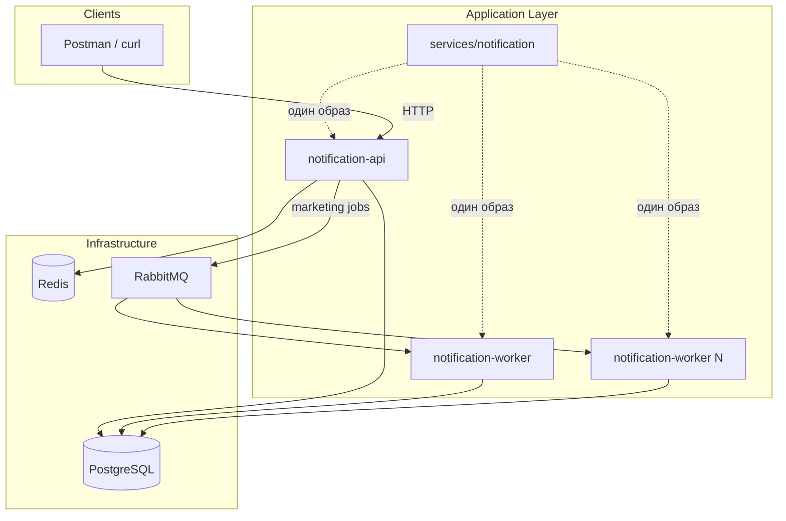
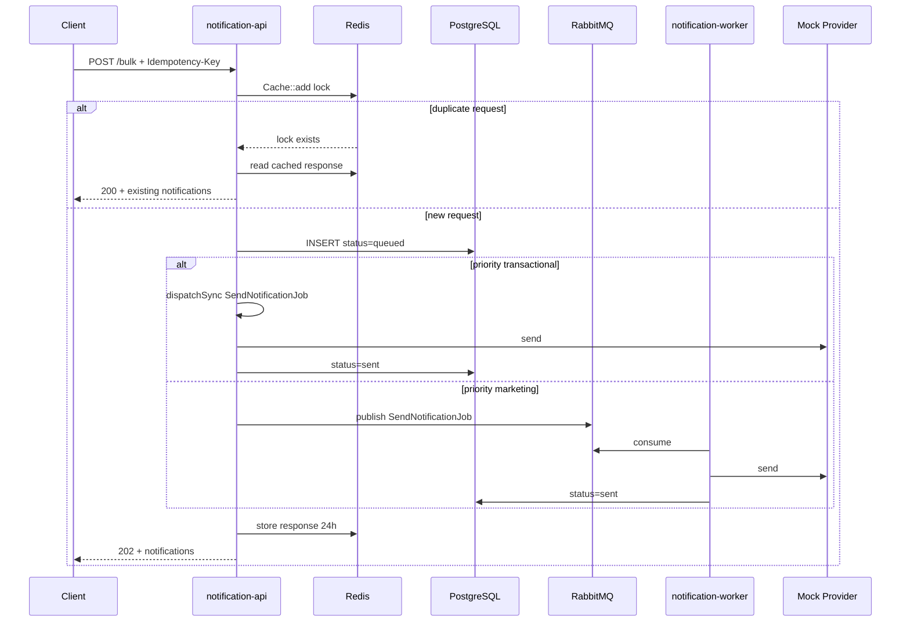

# Notification Service

Микросервис массовых уведомлений (SMS/Email) для тестового задания «Умная Логистика».

**Стек:** Laravel 11, PostgreSQL, RabbitMQ, Redis.

## Архитектура

Принцип: **единый codebase** (`services/notification/`) и **два независимых процесса** в docker-compose. Собираются из одного Docker-образа (`services/Dockerfile`), различаются только entrypoint — задел под отдельные Pod в Kubernetes.



| Роль | Контейнер | Процесс | Масштабирование |
|------|-----------|---------|-----------------|
| API | `notification-api` | `php artisan serve` | по HTTP-нагрузке |
| Worker | `notification-worker` | `php artisan queue:work rabbitmq` | по глубине очереди |

```bash
docker compose up --scale notification-worker=3
```

**Разделение ответственности:**

- **API** — HTTP, миграции БД, запись уведомлений, идемпотентность (Redis), публикация marketing-задач в RabbitMQ, transactional-отправка через `dispatchSync` в том же процессе.
- **Worker** — потребление очереди `notifications.marketing`, вызов mock-провайдеров, обновление статусов в PostgreSQL, retry при временных сбоях. HTTP не поднимает.

**Структура репозитория:**

```
umnaya_logistica/
├── docker-compose.yml
├── docs/
└── services/
    ├── notification/   # Laravel 11 — весь код
    ├── api/              # entrypoint: migrate + serve
    ├── worker/           # entrypoint: queue:work rabbitmq
    └── Dockerfile        # multi-stage: base → api / worker
```

Описание API: [TZ.md](TZ.md#api-контракт-реализация).

## Бизнес-логика приоритетов

По ТЗ критичные сообщения (коды доступа, срочные изменения маршрутов) должны доставляться **без задержек** — вне общей очереди, обгоняя маркетинговые рассылки.

В запросе `POST /api/v1/notifications/bulk` поле `priority` задаёт маршрут обработки:

| Приоритет | По умолчанию | Поведение |
|-----------|--------------|-----------|
| `transactional` | нет | `SendNotificationJob::dispatchSync()` — отправка сразу в процессе API, RabbitMQ не используется |
| `marketing` | **да** | `SendNotificationJob::dispatch()->onQueue('notifications.marketing')` — задача в durable-очередь RabbitMQ, обработка worker |

Примеры:

- SMS с кодом входа → `"priority": "transactional"`
- Email-рассылка акций → `"priority": "marketing"` или поле можно не передавать

Очередь `notifications.marketing` объявляется драйвером `laravel-queue-rabbitmq` с `queue_max_priority: 10` (задел под приоритизацию внутри marketing-потока).

## Надёжность и идемпотентность



**Идемпотентность** (заголовок `Idempotency-Key`):

- Redis: `Cache::add` — блокировка ключа на 24 ч (`IdempotencyService`).
- Redis: кэш ответа с `notification_ids` — повторный запрос возвращает **200** с теми же ID.
- PostgreSQL: unique `(idempotency_key, subscriber_id)` — защита на уровне БД при гонках.

**Доставка сообщений (at-least-once):**

- Очередь RabbitMQ `notifications.marketing` — durable (драйвер `laravel-queue-rabbitmq`).
- `SendNotificationJob`: `$tries = 3`, `$backoff = [10, 60, 300]`.
- Worker запускается с `--tries=3 --backoff=10,60,300`.
- Временная ошибка провайдера (`ProviderTemporaryException`) — повторная попытка.
- Исчерпанные попытки попадают в таблицу `failed_jobs` (стандартный механизм Laravel).

**Защита от повторной обработки (бизнес-уровень):**

- Job пропускает отправку, если статус уже `sent`, `delivered` или `rejected`.
- После успешной отправки mock-провайдер планирует `ConfirmDeliveryJob` (подтверждение `delivered`).

## Быстрый старт

```bash
cp .env.example .env
# Сгенерируйте APP_KEY (или задайте вручную):
# docker run --rm -v $(pwd)/services/notification:/app -w /app composer:2 php artisan key:generate --show

docker compose up --build
```

API: http://localhost:8080  
RabbitMQ Management: http://localhost:15673 (guest/guest)

Порты на хосте (если 5432/6379/5672 заняты): PostgreSQL `5433`, Redis `6380`, RabbitMQ `5673`.

## Тесты

Тесты лежат в `services/notification/tests/` (Feature + Integration). Для PHPUnit используется SQLite in-memory, поднимать PostgreSQL/RabbitMQ/Redis не нужно.

**Все тесты** (стек может быть запущен или нет):

```bash
docker compose run --rm --no-deps --entrypoint php notification-api artisan test
```

**Если контейнер API уже работает:**

```bash
docker compose exec notification-api php artisan test
```

**Отдельные наборы или файл:**

```bash
docker compose run --rm --no-deps --entrypoint php notification-api artisan test --testsuite=Feature
docker compose run --rm --no-deps --entrypoint php notification-api artisan test --testsuite=Integration
docker compose run --rm --no-deps --entrypoint php notification-api artisan test tests/Feature/BulkNotificationTest.php
```

Покрытие: массовая рассылка, идемпотентность, приоритеты (transactional/marketing), история подписчика, цепочка доставки, retry.

## API

| Метод | Endpoint | Описание |
|-------|----------|----------|
| POST | `/api/v1/notifications/bulk` | Массовая рассылка |
| GET | `/api/v1/subscribers/{id}/notifications` | История подписчика |
| POST | `/api/v1/notifications/{id}/delivery-callback` | Callback доставки |

### Пример: массовая SMS-рассылка

```bash
curl -X POST http://localhost:8080/api/v1/notifications/bulk \
  -H "Content-Type: application/json" \
  -H "Idempotency-Key: $(uuidgen)" \
  -d '{
    "channel": "sms",
    "message": "Ваш код: 1234",
    "recipient_ids": ["sub-001"],
    "priority": "transactional"
  }'
```

### Пример: история подписчика

```bash
curl "http://localhost:8080/api/v1/subscribers/sub-001/notifications?status=sent"
```

## Документация API

- **OpenAPI (Swagger):** [docs/openapi.yaml](docs/openapi.yaml) — импорт в [Swagger Editor](https://editor.swagger.io/)
- **Postman:** [docs/postman/notification-service.postman_collection.json](docs/postman/notification-service.postman_collection.json)

## Kubernetes (будущее масштабирование)

- Один Docker-образ → два Deployment (`notification-api`, `notification-worker`)
- API: Service + Ingress
- Worker: HPA/KEDA по метрике глубины очереди RabbitMQ
